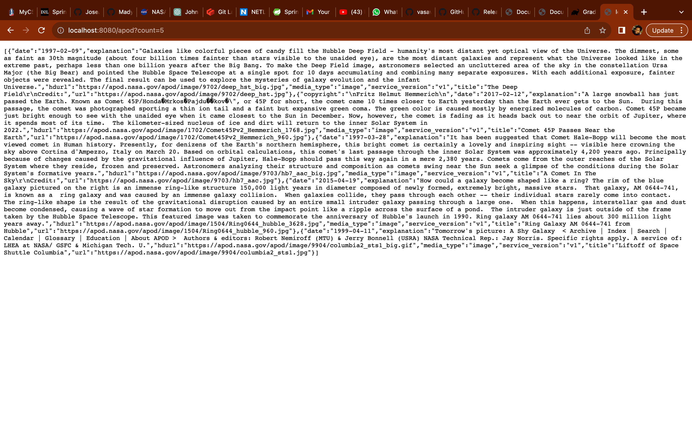
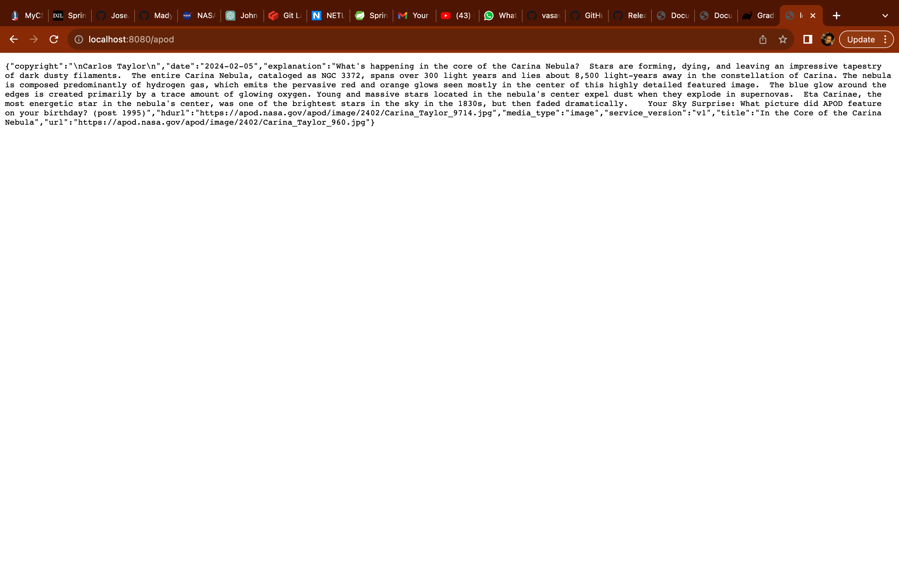

---

# NASA APOD API Integration

This Spring Boot application integrates with the NASA Astronomy Picture of the Day (APOD) API. It provides an endpoint `/apod` that allows users to retrieve the picture of the day along with its information by passing optional query parameters.

## Features

- Retrieve the APOD image and its information.
- Specify query parameters such as `date`, `start_date`, `end_date`, `count`, and `thumbs` to customize the API response.
- Error handling for invalid requests.

## Setup

1. **Clone the Repository**: Clone this repository to your local machine using the following command:
   ```bash
   git clone https://github.com/yourusername/Webg.git
   ```

2. **Build and Run the Application**: Navigate to the project directory and run the following Gradle command to build and run the application:
   ```bash
   ./gradlew bootRun
   ```
   The application will start on port 8080 by default.

3. **Access the API**: You can access the API endpoint by making HTTP GET requests to `http://localhost:8080/apod`. You can also pass optional query parameters as described below.

## Usage

### Endpoint

- **GET** `/apod`: Retrieve the Astronomy Picture of the Day.

### Query Parameters

- `date`: The date of the picture in YYYY-MM-DD format.
- `start_date`: The start date for a range of pictures in YYYY-MM-DD format.
- `end_date`: The end date for a range of pictures in YYYY-MM-DD format.
- `count`: The number of pictures to retrieve (for a date range).
- `thumbs`: Whether to include thumbnail URLs in the response (`true` or `false`).

### Example Requests

- Retrieve the picture of the day:
  ```
  GET http://localhost:8080/apod
  ```

- Retrieve the picture for a specific date (e.g., January 1, 2024):
  ```
  GET http://localhost:8080/apod?date=2024-01-01
  ```

- Retrieve a range of pictures between two dates (e.g., January 1, 2024 to January 7, 2024):
  ```
  GET http://localhost:8080/apod?start_date=2024-01-01&end_date=2024-01-07
  ```

- Retrieve the last 5 pictures:
  ```
  GET http://localhost:8080/apod?count=5
  ```

- Retrieve the picture of the day with thumbnails:
  ```
  GET http://localhost:8080/apod?thumbs=true
  ```

## Dependencies

- Spring Boot
- RestTemplate




